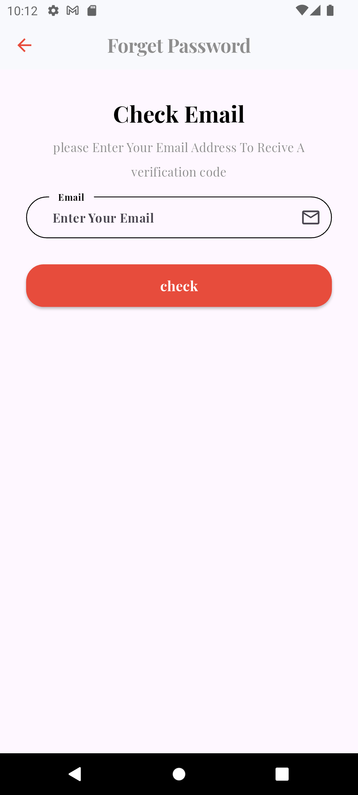
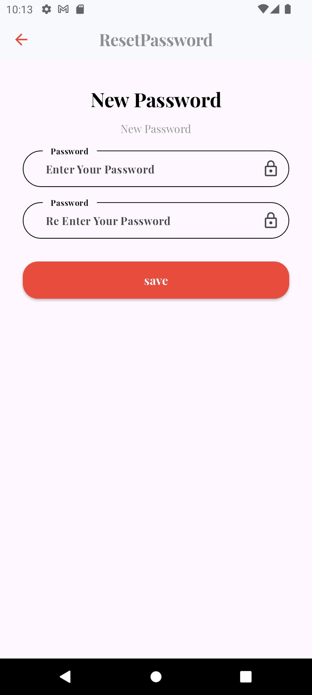

# InDrive Clone 🚗  
A comprehensive ride-hailing and delivery service application built using **Flutter** for the frontend and **PHP/MySQL** for the backend.

## ✨ Key Features
- **User Authentication** 🔐
  - Phone number verification
  - Profile creation

- **Ride Services** 🚘
  - Local rides
  - City-to-city travel
  - Ride tracking
  - Driver selection

- **Freight Delivery** 📦
  - Cargo description
  - Vehicle selection
  - Scheduling options

- **Ride History** 📝
  - Trip details
  - Receipt generation
  - Support access

- **Multiple Payment Options** 💰

## 📸 Screenshots

## 🛠️ Tech Stack
- **Frontend**:  
    
  

- **Backend**:  
    
  

- **Maps & Location**:  
  

## 🚀 Implementation Details
- **Location-based Services**: Real-time tracking of drivers and rides
- **Authentication System**: Secure phone number verification
- **Interactive UI**: User-friendly interface for easy navigation
- **Multiple Service Types**: Supports various transportation and delivery needs
- **Payment Integration**: Secure payment processing

---

