# 🛒 E-Commerce App  
A modern and feature-rich e-commerce application built using **Flutter** for the frontend and **PHP/MySQL** for the backend.

## ✨ Key Features
- **User Authentication** 🔐
  - Sign in with Email
  - Sign in with Google
  - Profile creation & management

- **Product Management** 🏷️
  - Browse products by categories
  - View product details with images & descriptions
  - Add items to the shopping cart

- **Cart & Checkout** 🛍️
  - Manage items in the cart
  - Apply coupons and discounts
  - Secure checkout process

- **Wishlist & Favorites** ❤️
  - Save favorite products for later
  - Sync wishlist across devices

- **Order & Delivery Tracking** 🚚
  - Add & manage shipping addresses
  - Track order status in real-time
  - Receive notifications for updates

- **Order History & Support** 📜
  - View past orders and purchase details
  - Download receipts & invoices
  - Contact customer support easily

## 📸 Screenshots

  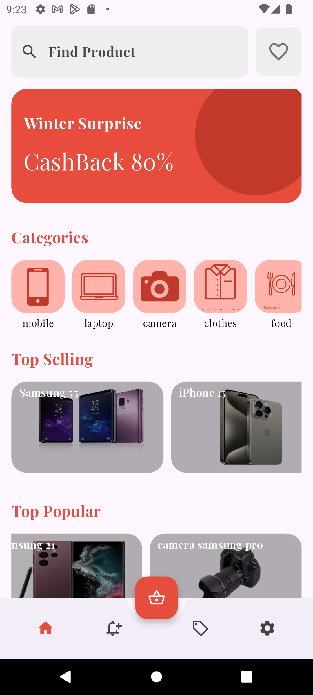
  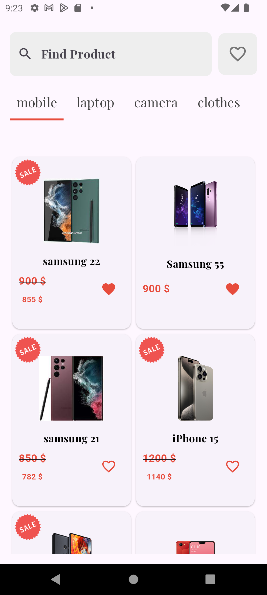
  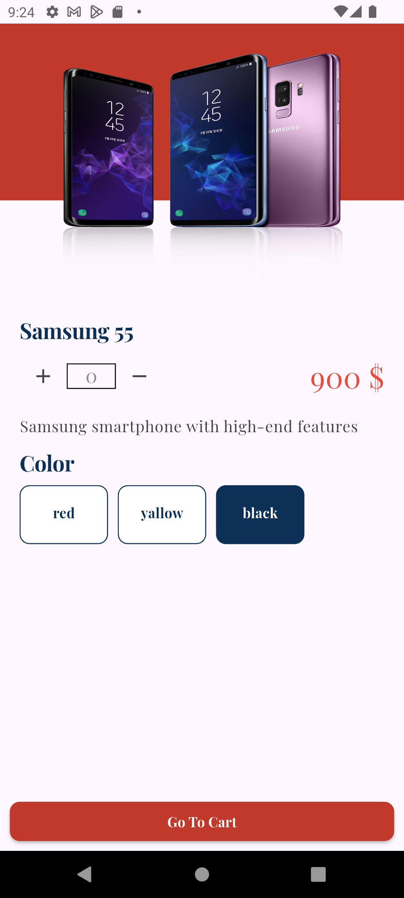
  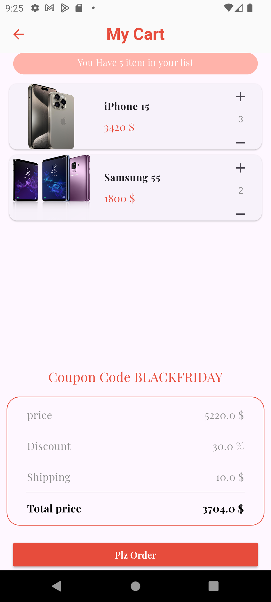
  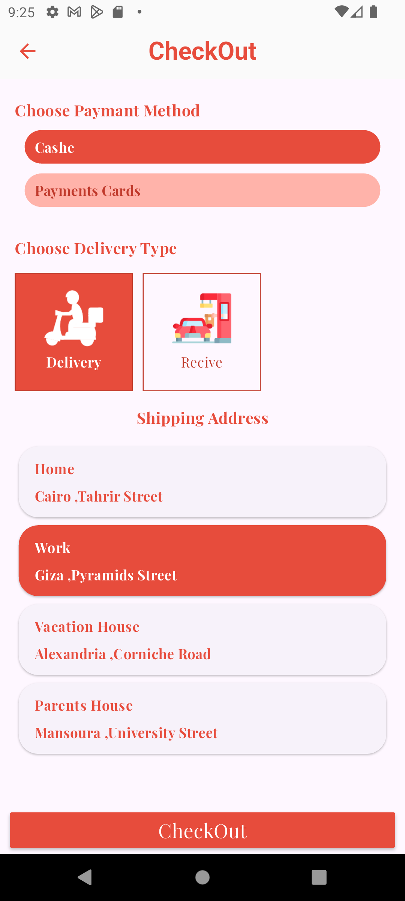
  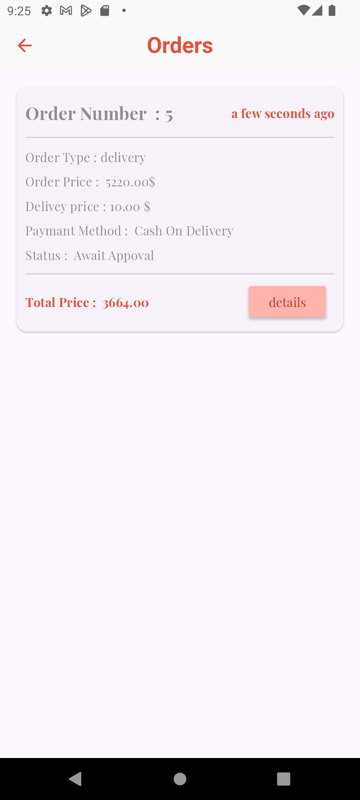
  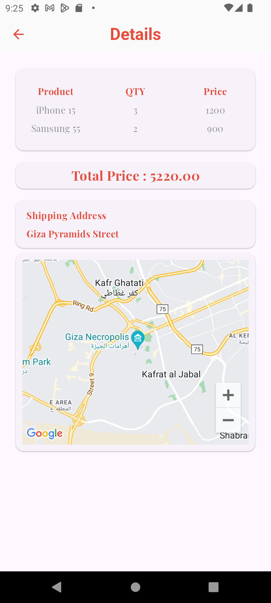
  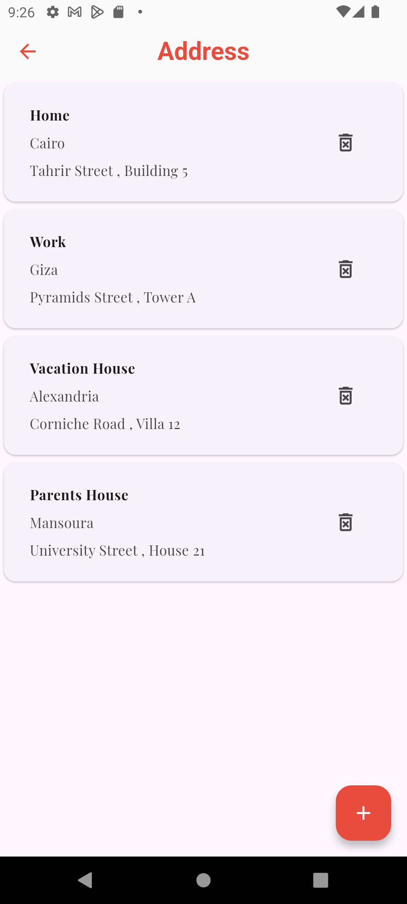
  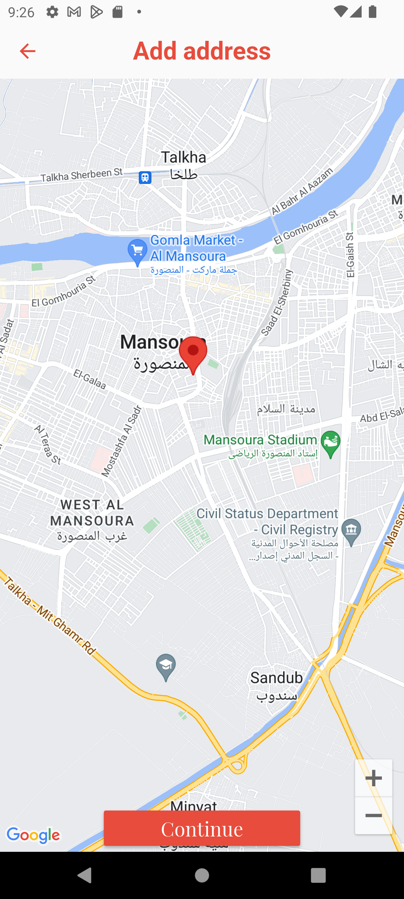
  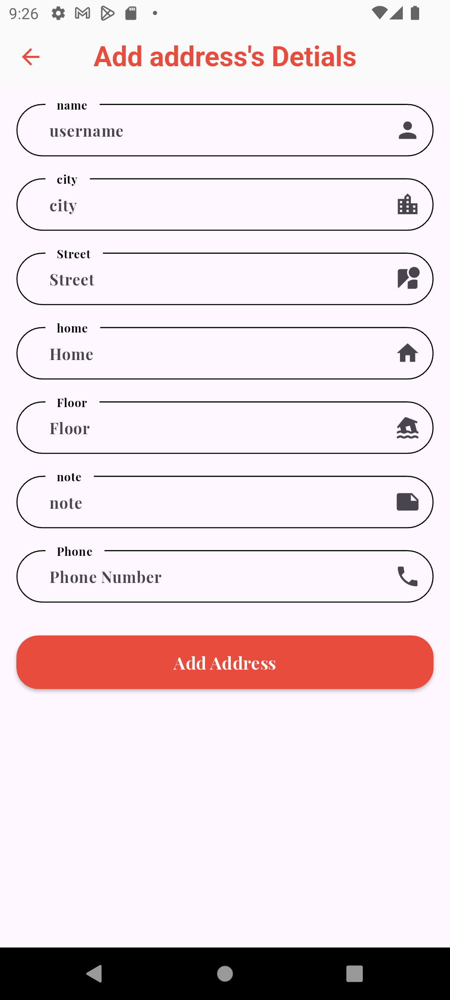
  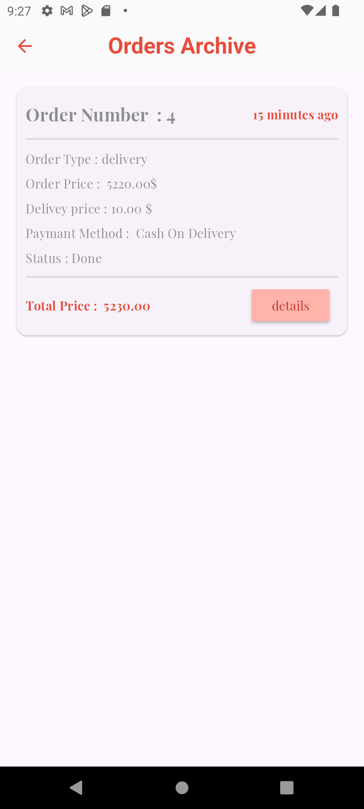
  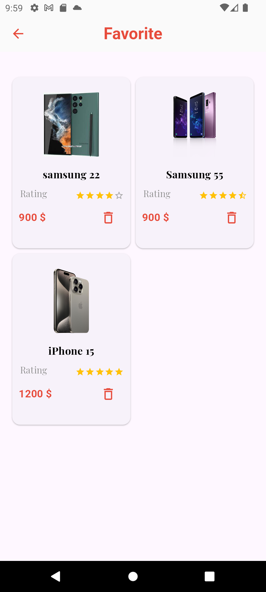
  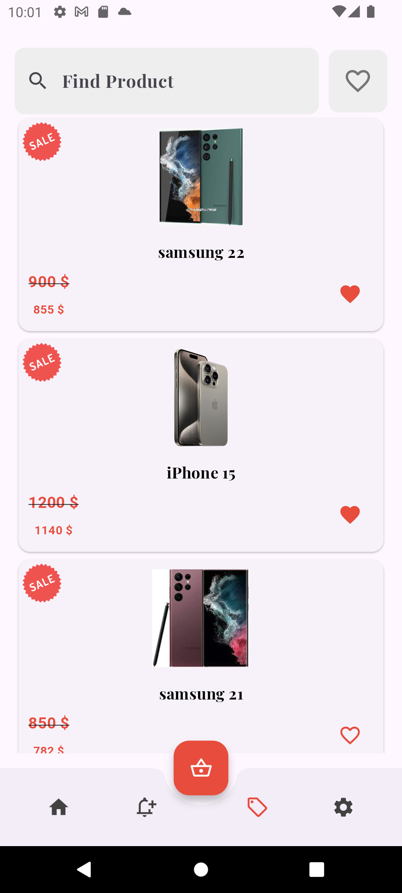
  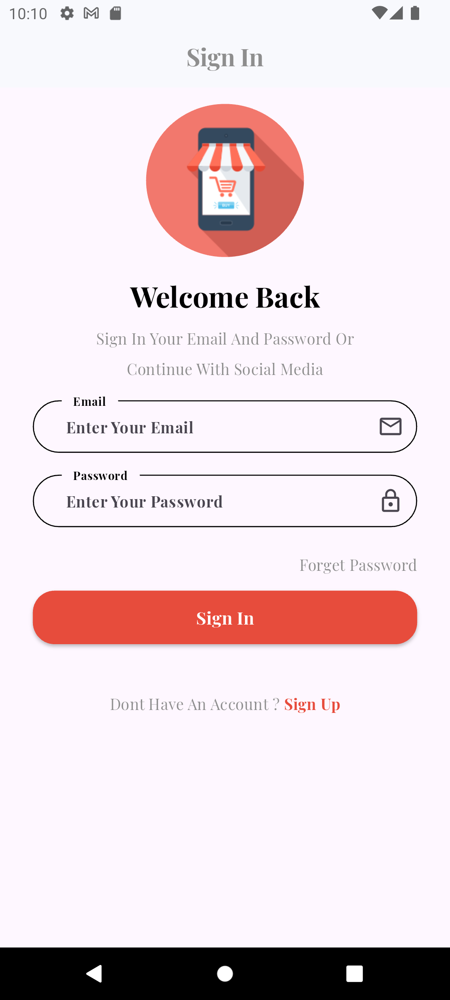
  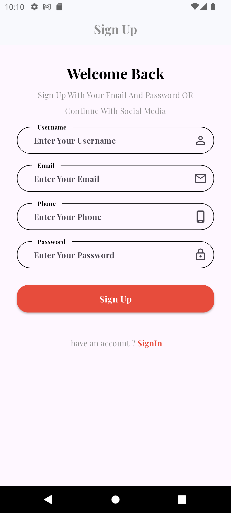
  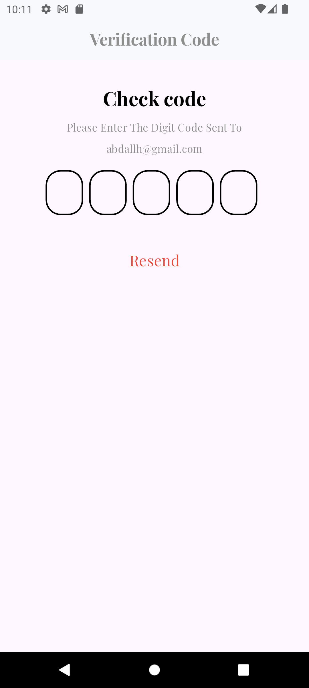
  
  

## 🛠️ Tech Stack
- **Frontend**:  
    
  

- **Backend**:  
    
  

## 🚀 Implementation Details
- **User-Friendly Interface**: Clean and intuitive UI for easy shopping
- **Secure Authentication**: Email and Google sign-in for quick access
- **Real-Time Order Tracking**: Stay updated on order progress
- **Wishlist & Favorites**: Save items for future purchases
- **Flexible Payment Options**: Multiple ways to pay securely
